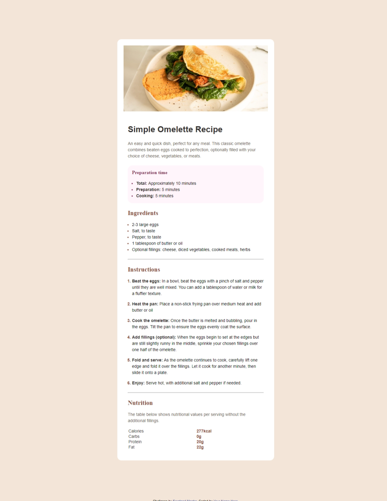

# Frontend Mentor - Recipe page solution

This is a solution to the [Recipe page challenge on Frontend Mentor](https://www.frontendmentor.io/challenges/recipe-page-KiTsR8QQKm). Frontend Mentor challenges help you improve your coding skills by building realistic projects. 

## Table of contents

- [Overview](#overview)
  - [The challenge](#the-challenge)
  - [Screenshot](#screenshot)
  - [Links](#links)
- [My process](#my-process)
  - [Built with](#built-with)
  - [What I learned](#what-i-learned)
  - [Continued development](#continued-development)
  - [Useful resources](#useful-resources)
- [Author](#author)
- [Acknowledgments](#acknowledgments)

## Overview

### Screenshot

### Links

- Solution URL: [Add solution URL here](https://your-solution-url.com)
- Live Site URL: [Add live site URL here](https://your-live-site-url.com)

## My process

### Built with

- Semantic HTML5 markup
- CSS custom properties
- flexbox
- Mobile-first workflow

### What I learned
I learnt this css propertyfor styling lists
<!-- li::marker{
    font-weight: 700;
} -->

### Useful resources

- [Html Tables](https://www.w3schools.com/html/html_tables.asp) - This helped me for border bottom on the table rows.
- [Semantic html](https://www.pluralsight.com/resources/blog/guides/semantic-html#:~:text=Semantic%20HTML%20Page%20Layout&text=header%2C%20main%2C%20and%20footer%20tags,webpages%20into%20tangible%20sections%20difficult.) - This is an amazing article which helped me finally understand semantic html tags.

